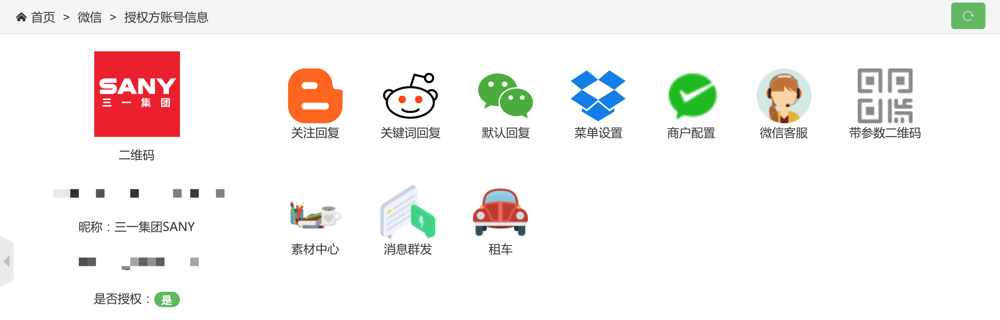
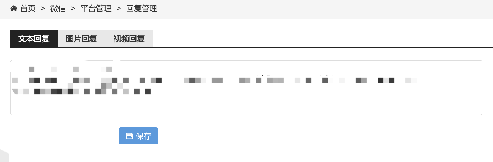

# 设置微信公众号自动回复

1. 登录WeChat.SANYGroup后台；

2. 依次点击【微信 > 公众号列表】，进入【公众号列表】；

3. 在对应的公众号中点击【详情】；

   

4. 在公众号详情中有关注回复、关键词回复和默认回复；

   关注回复：用户关注公众号后的回复信息

   关键词回复：当用户发送某个关键词后触发回复

   默认回复：当用户的关键词无法触发回复事件（如关键词回复）时的回复

   

5. 回复的内容分为三种类型：文本、图片和视频，选择对应类型进行回复内容编辑即可。

